## 1. Creo la maquina amb 8gb de ram i 4 nuclis.

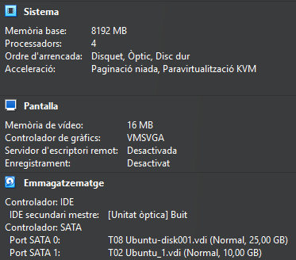

## 2. Creo una nova partició en el disc.

## 3. Comprovo que esta correcta.

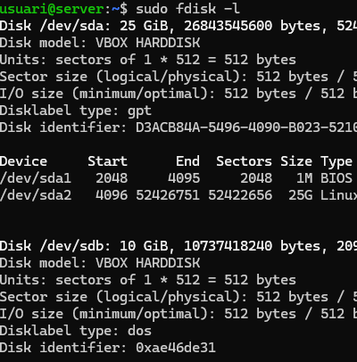

## 4. Li dono un format XFS.

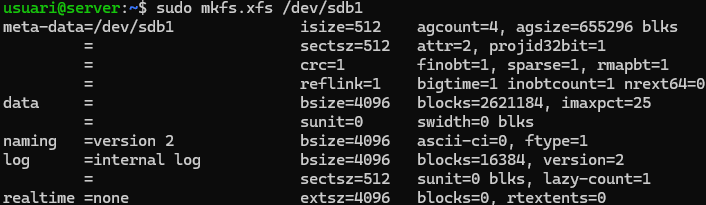

## 5. Instal·lo Duplicity
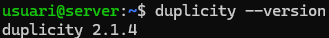

## 6. Creo els usuaaris i els hi estableixo una contrasenya per a iniciar sessió.

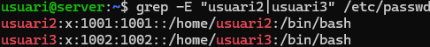
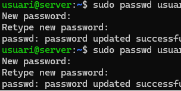

## 7. Creo arxius de prova.

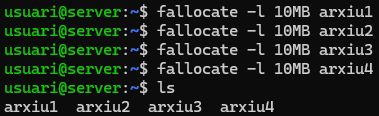

## 8. Faig que es dui a terme una còpia de seguretat a la carpeta /home.

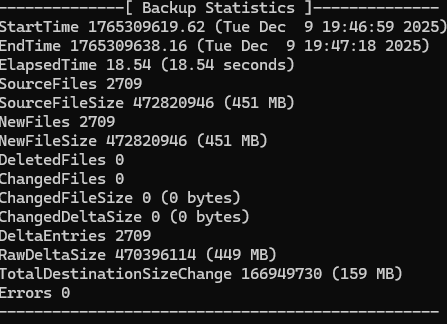

## 9. Comprovo que s'han creat els arxius de la còpia de seguretat correctament.

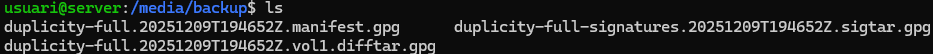

## 10. Restauro les dades i comprovo que s'ha realitzat correctament.

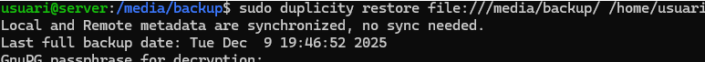
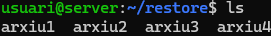

## 11. Afegeixo un nou fitxer.

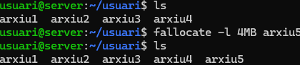

## 12. A la hora de realitzar la còpia només còpia el fitxer nou i el posa juntament amb els demés, això es diu "còpia incremental".

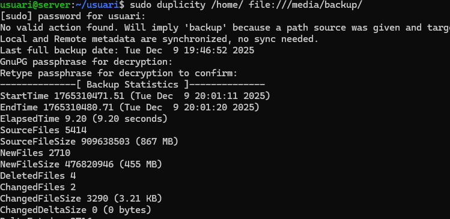

## 13. Creem l'escript per a realitzar la còpia de seguretat automatica, i li dono permisos d'execució.

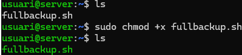

## 14. Configuro el Cron per a que s'executi entre els dies i hores que jo demani (de dilluns a les 11:00pm a dissabte a les 11:00pm).

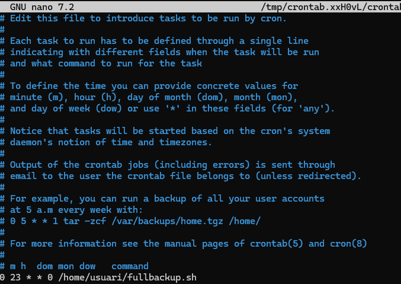
