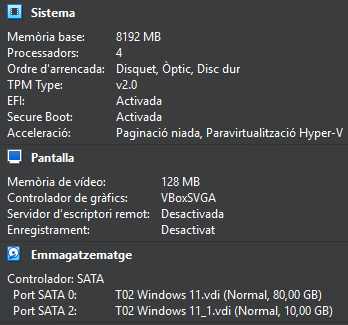
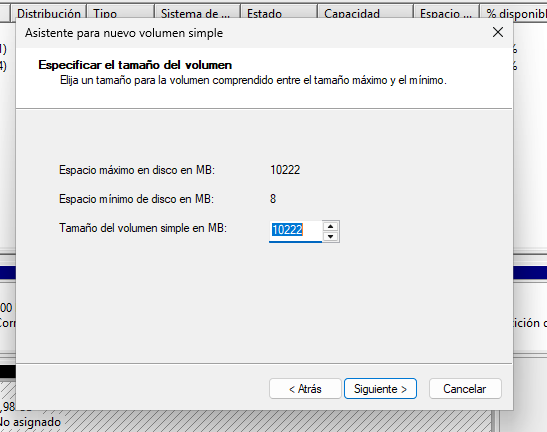
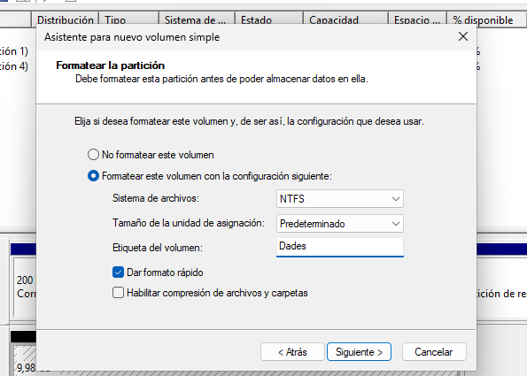
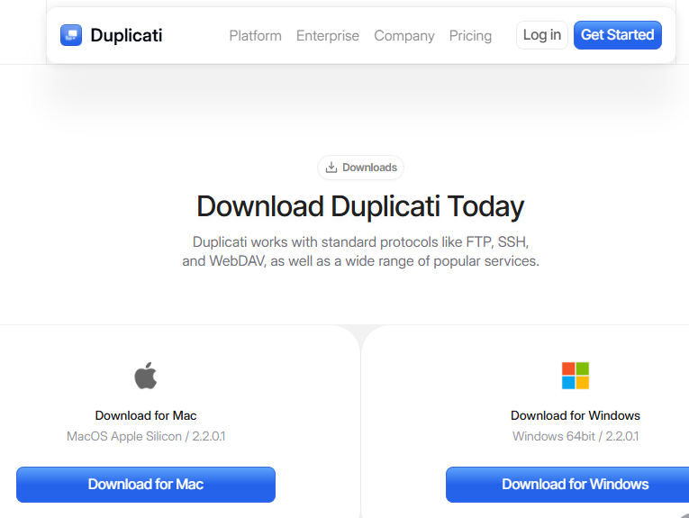
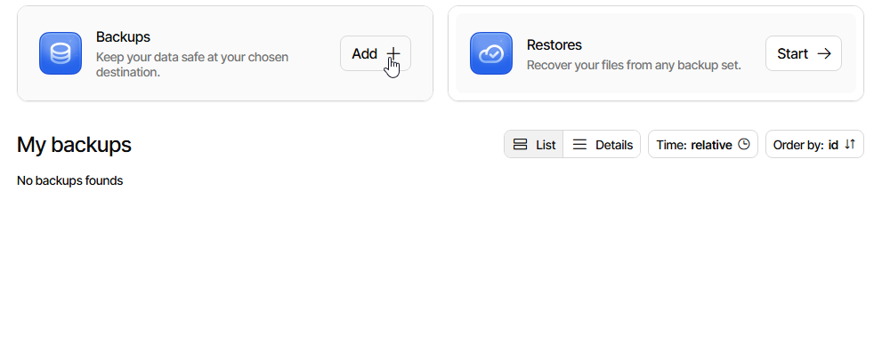
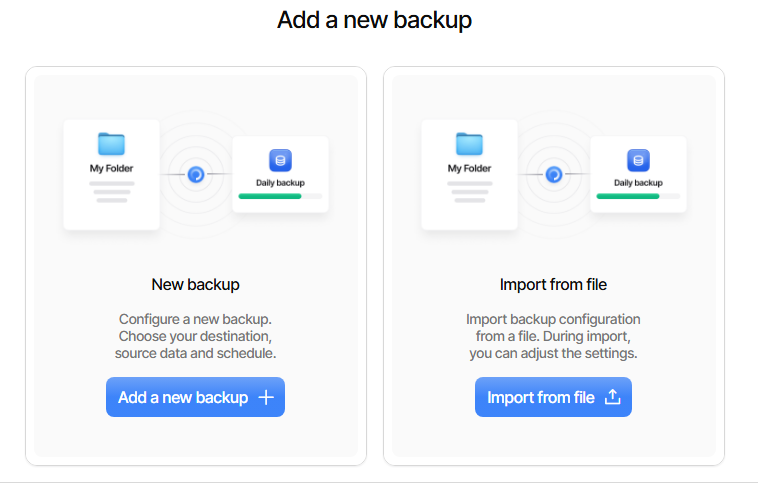
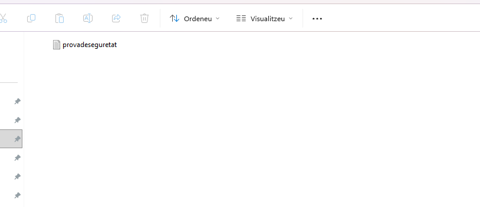

1. Instal?lem la maquina virtual amb els requisits corresponents.

3. Creo i formato les particions del disc de la maquina virtual.

5. Clico en formatar el disc amb gpt.

7. Creo un nou volum simple.

7. Descarrego Duplicati des del seu web oficial i procedeixo a instal·larlo.

8. Creo un backup.

9. Afegeixo un fitxer a documents per a comprovar si es guarda el fitxer amb la còpia de seguretat creada.
   
 

11. Clico en guardar còpia de seguretat i borro el arxiu que he creat fa uns segons.

13. Restauro el arxiu fent que recuperi la còpia de seguretat.
    

13. Conecto la meva compta de google amb Duplicati per a que em fagi les copies de seguretat en google drive.

14. Creo una carpeta i configuro unes còpies de seguretat automàtiques per a cada dia a les 18:00 hores.

