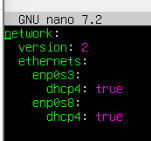
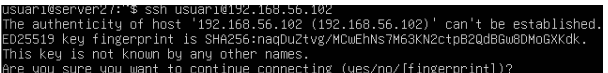
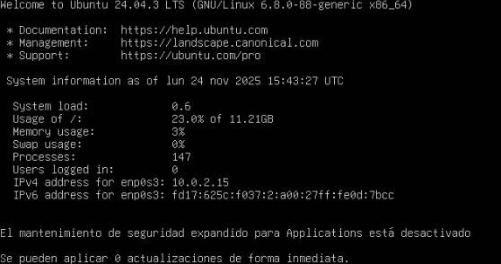
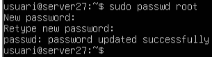
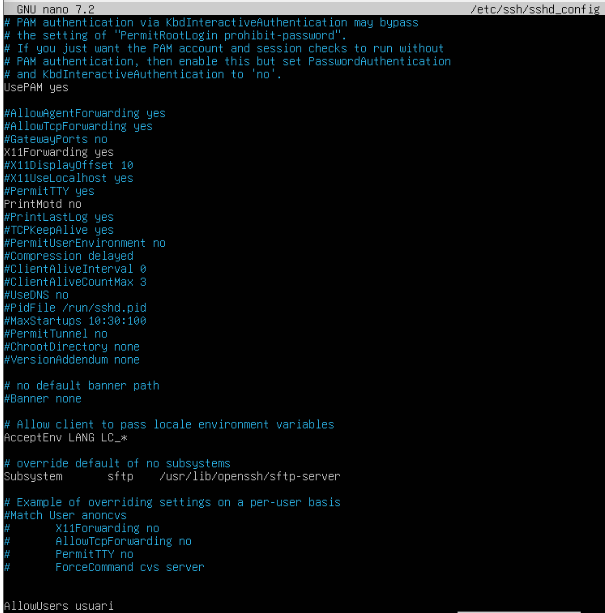
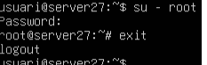
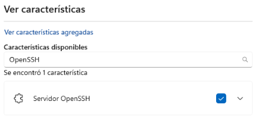
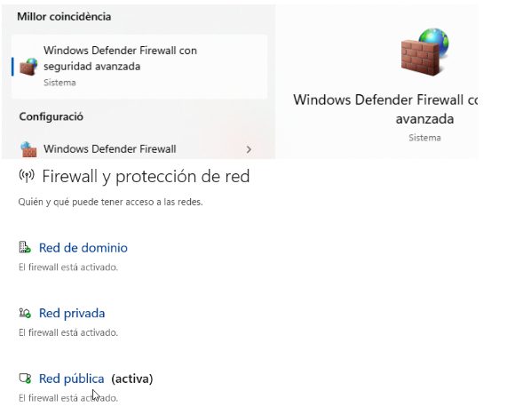

#### 1. Configuro l’arxiu netplan amb la comanda sudo nano, per a que la xarxa funcioni correctament.

#### 2. Instalo el servei ssh amb la comanda apt install.

#### 3. Comprovo la ip que m’ha assignat automaticament amb la comanda ip addr show.

#### 4. Comprovo la connexió mitjançant la comanda ssh usuari@ i escric la meva ip a continuació.

#### 5. Verifico que treballo exactament igual com si ho fes desde la maquina Zorin.

#### 6. Habilito l’usuari root i agregant-li una contrasenya

#### 7. Afegeixo la última linea del codi, en la que autoritzo l’usuari “usuari”

#### 8. Iniciare sessió de manera local amb l’usuari root.

#### 9. Obro configuració, vaig a caracteristiques i comprovo si esta el servidor OpenSSH.

#### 10. En caracteristiques disponibles afegeixo OpenSSH buscant-lo en el buscador.

#### 11. Seguidament, desactivo el Tallafoc perquè el Windows no bloquegi  la comunicació via SSH.

