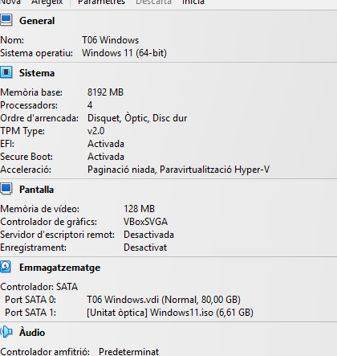
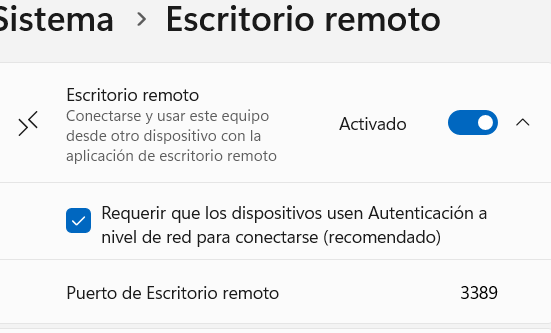
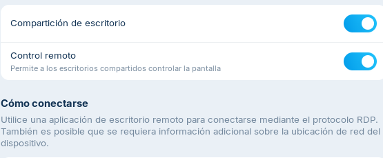
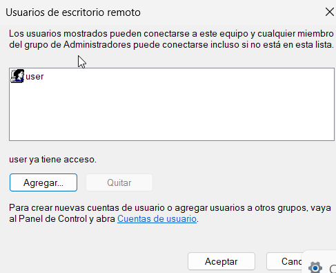
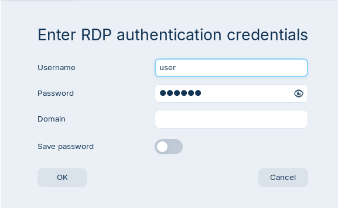
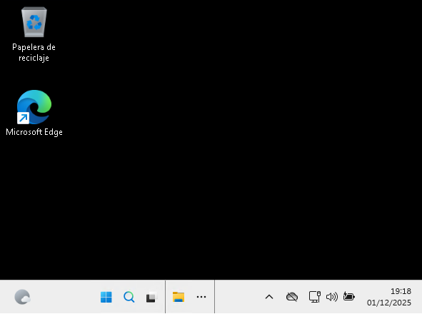

1. Configuro les dues màquines en xarxa nat.

2. Configuro la màquina client windows i una màquina host Zorin i habilito el sistema de escriptori remot.

4. Creo un ususari que tindra permis per accedir remotament.

6. Desde Zorin utilitzo Remmina per a accedir al control remot del sistema.

7. Poso un nom d'usuari qualsevol.

8. Inicio sessió amb el usuari i contrasenya previament creat des de la màquina windows.

9. Veig la pantalla de la màquina client Windows desde la la màquina de host Zorin.

