## 1. Creació de Grups: Crear dos grups per al client: devs i admins. Creació d'Usuaris: Crear un usuari dev01 (membre del grup devs). Crear un usuari admin01 (membre del grup admins). Creació de Directoris (al Servidor):

SERVER:

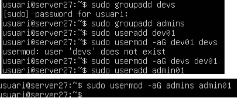

ZORIN (maquina client):

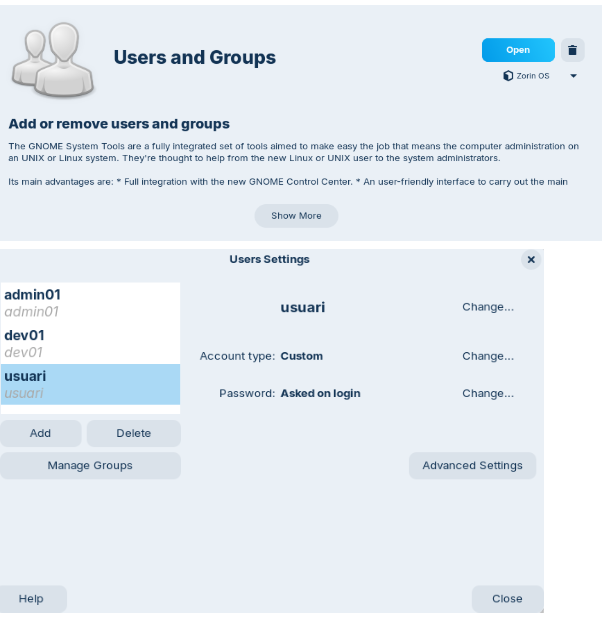

## 2. Crear el directori per als projectes de desenvolupament: /srv/nfs/dev_projects.

Crear el directori per a les eines d'administració: /srv/nfs/admin_tools

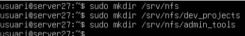

## 3. Permisos del Servidor (El punt clau):

Es vol que els developers tinguin control total sobre els seus projectes.

Es vol que els administradors tinguin control sobre les seves eines.

En tots dos casos, l'usuari propietari serà root.

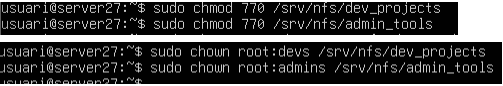

## 4. Com a pas final, s'instal·laran els paquets necessaris per al servei NFS al servidor i es configurarà l'exportació dels directoris amb les opcions adequades.

4.1. Creació recurs compartit:

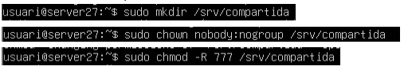

4.2. Configuració NFS:

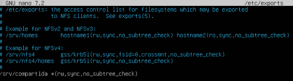

## 5. sudo systemctl restart nfs-kernel-server:

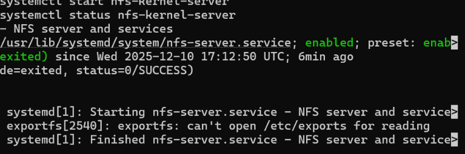

## 6. NFS activa root_squash, que fa que l'usuari root es transformi en nobody i aixo fa que no puguem avançar, ho solucionem amb la seguent comanda:

## 7. Per a solucionar aquest problema de permisos editem l'arxiu /exports novament i fem el seguent:

## 8. Reinicio el sistema:

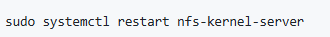

## 9. Canvio la IP del client:

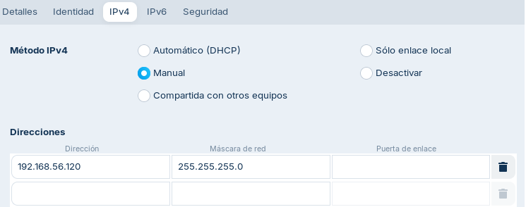

## 10. Desmonto i monto la carpeta.

sudo umount /mnt/dev_projects

sudo mount ip-servidor:/srv/nfs/dev_projects /mnt/dev_projects

## 11. Comprovo que el DEV només poden llegir i el ADMIN no pot accedir

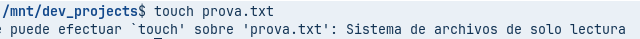

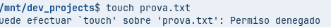

## 12. Munto automàticament les carpetes editant l'arxiu /etc/fstab:

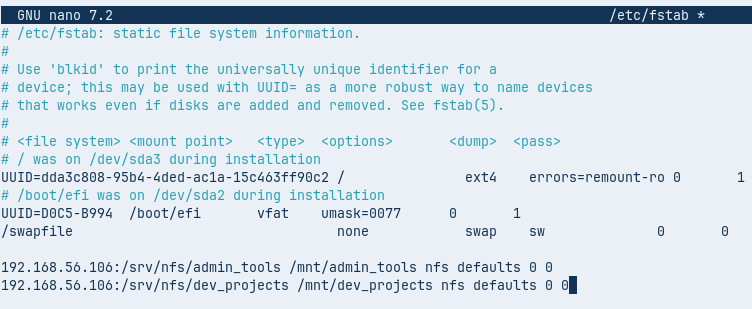

## 13. Comprovo que funciona correctament.

